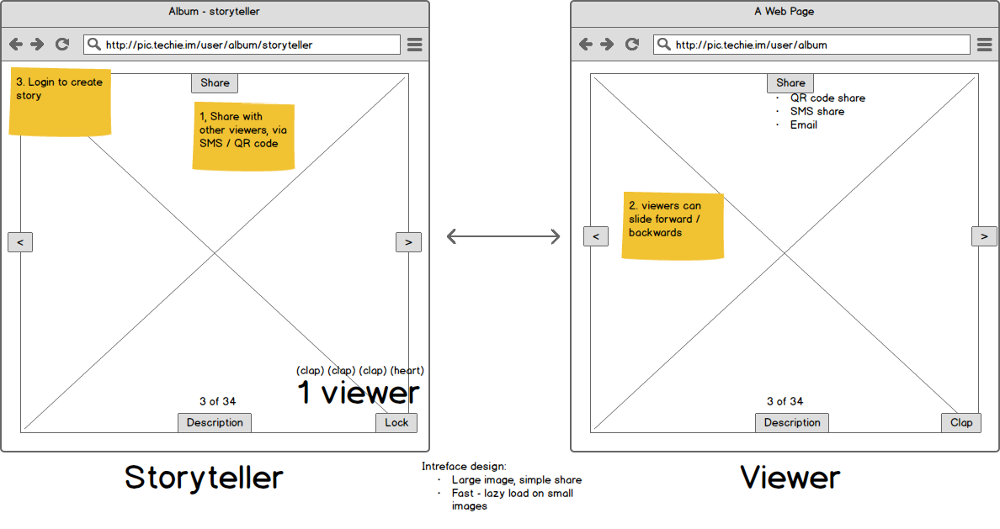

話 hanashi
==========

> Telling a story

A tool to helps you to tell a story, not just online, but face
to face to your friends.




# Getting started

The local development setup runs on local Django server.

The current development have dependencies on cloud service:

* Working PostgreSQL server
* Google Cloud storage for static assets hosting

You should follow the [GCE tutorial](https://cloud.google.com/python/django/kubernetes-engine) to setup these dependencies.
A work in progress tutorial to [setup Django channel with GCE](https://docs.google.com/document/d/1iTl5Tw9hwppsO0YA-eoGt9mfwUwJg1q6LLMv-qYlWWE/edit#) is also available.

After the above setup, you can run:

```
cd web
# Build SPA and Collect static file
make build-deploy-spa

# create development server
make dev
```

Now you can go to http://localhost:8000 for your local server

## Front-end development

```
cd web/slideshow-spa
yarn start
```

Then you can go to http://localhost:3000 for a hot reload version of the front-end server.


# Folder structure

* [Django app](/web) is in the `/web`
* [React SPA app used by slideshow](/web/slideshow-spa) is in `/web/slideshow-spa`
